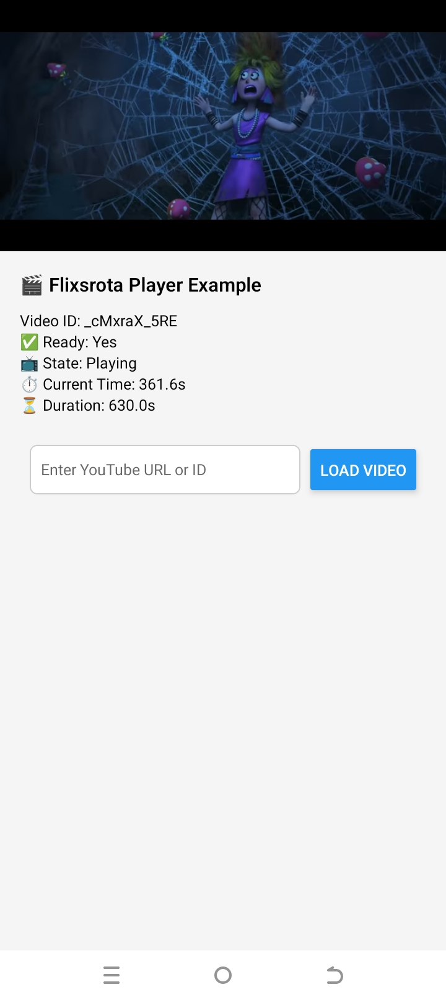
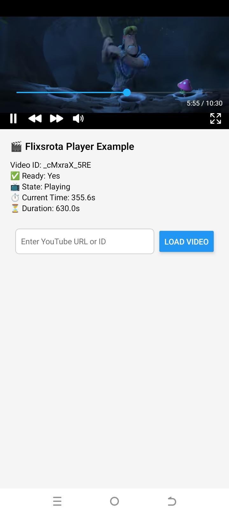
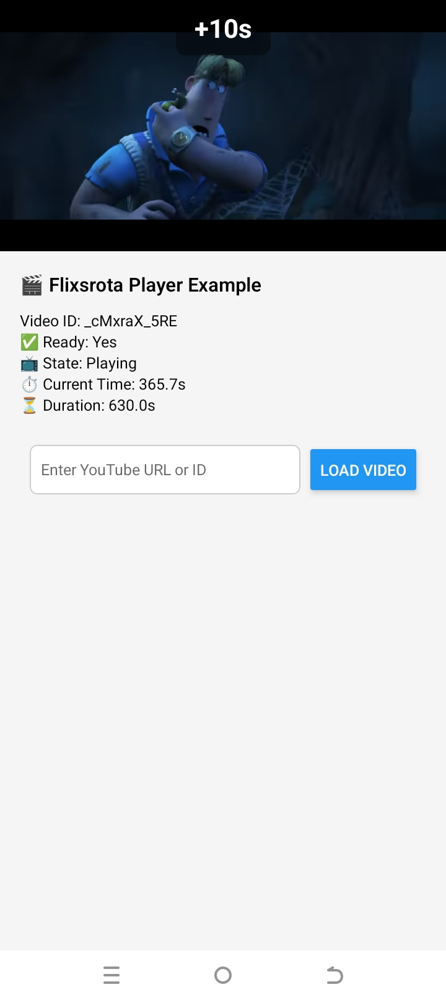
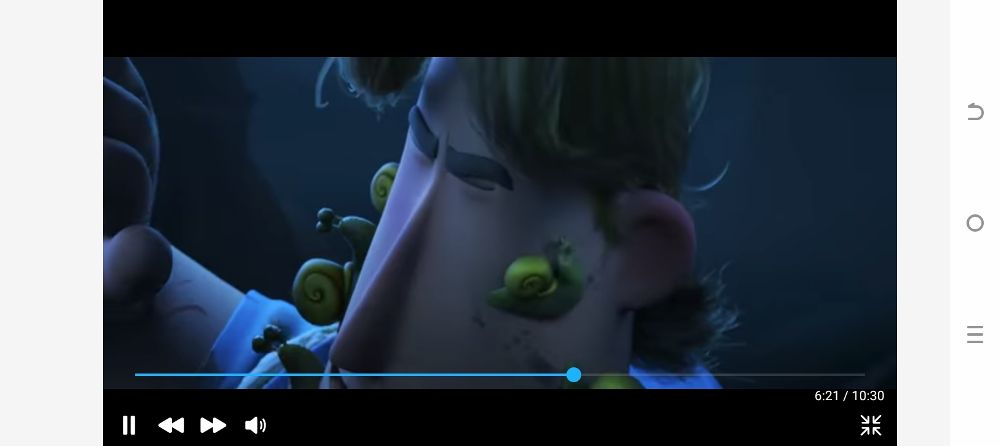
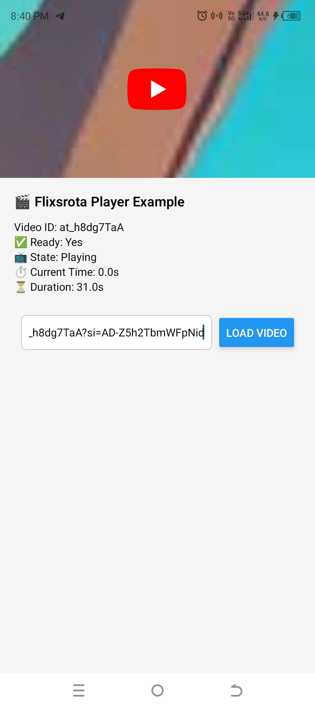
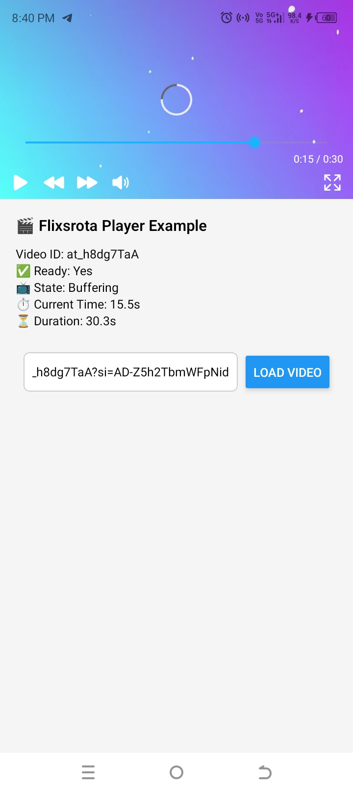
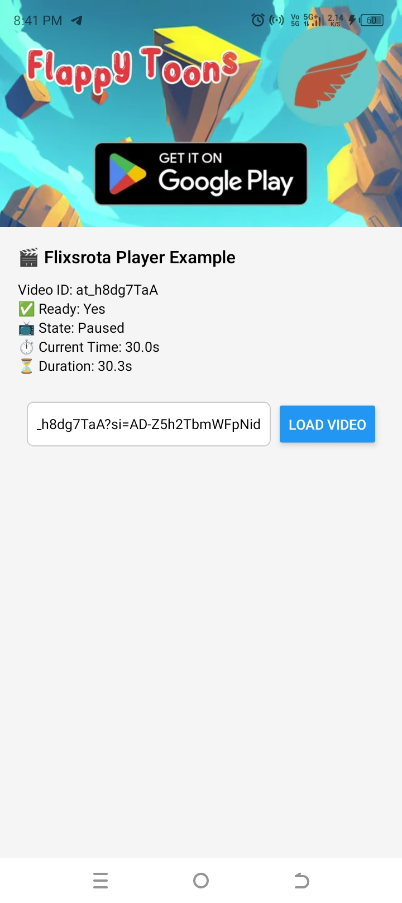

# 🎬 Flixsrota Player

A distraction free(without recommendations, share buttons, or channel overlays) implementation of youtube video player. Future versions will integrate with the upcoming Flixsrota Video Server, enabling adaptive streaming


---

## 🖼️ Preview









---


## ✨ Features
- 🎥 Play YouTube videos by **ID**
- 📱 Works on **React Native CLI** and **Expo**
- 🔄 Fullscreen toggle with orientation lock
- ▶️⏸️ Play / Pause controls
- 🔇🔊 Mute / Unmute support
- 🎚️ Gesture & slider-based seeking
- ⚡ Lightweight and easy-to-use
- 🛠️ Supports hooks for player state (ready, video states, current time, and total duration, etc.)


---

## 📦 Installation

### 1. Install the package
Using **npm**:
```bash
npm install @flixsrota/player
```

Using **yarn**:
```bash
yarn add @flixsrota/player
```

### 2. Install orientation support

This library uses device orientation for fullscreen video handling.  
Install based on your ecosystem:

#### ✅ Expo
```bash
expo install expo-screen-orientation
```

#### ✅ React Native CLI
```bash
npm install react-native-orientation-locker
# or
yarn add react-native-orientation-locker
```

---

## 🚀 Usage

```tsx
import { View, Text } from "react-native";
import { PlayerView } from "@flixsrota/player";

export default function App() {
  return (
    <View style={{ flex: 1 }}>
      <PlayerView videoId="_cMxraX_5RE" />
      <Text>Flixsrota Player Example</Text>
    </View>
  );
}
```

---

## 📂 Project Structure

```
├── assets/                # Images for preview & docs
├── example/               # Example Expo app
├── lib/                   # Build output (JS + types)
│   ├── module/            # Compiled JavaScript (for publishing)
│   └── typescript/        # TypeScript declaration files
├── src/                   # Source code (TypeScript)
│   └── __tests__/         # Tests (need to be implemented)
├── .github/               # Contribution configs (CI/CD, hooks)
```
---

## 🤝 Contributing

- [Development workflow](CONTRIBUTING.md#development-workflow)
- [Sending a pull request](CONTRIBUTING.md#sending-a-pull-request)
- [Code of conduct](CODE_OF_CONDUCT.md)

---

## 🗣️ Discussions & Feature Requests

📢 **Important:** We do not accept feature requests or questions via issues.  
If you want to request a feature or need help, please use **GitHub Discussions** only:

- 💡 [Request a Feature](https://github.com/NIKHIL0VERMA/flixsrota-player/discussions/new?category=ideas)  
- 💬 [Ask a Question / General Discussion](https://github.com/NIKHIL0VERMA/flixsrota-player/discussions)

This ensures issues are only used for bug reports and development tasks.

---

## 📜 License

MIT © [Nikhil Verma](https://github.com/NIKHIL0VERMA)